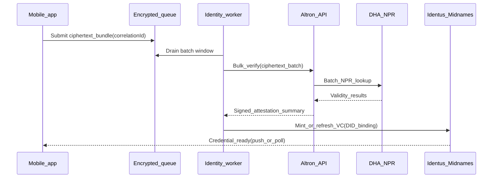

# ADR 0001 — Async batch verification via Altron/DHA

## Status

Accepted — scaffold phase (2026-05-02)

## Context

Real-time DHA digital verifications became disproportionately expensive versus batch/non-live tiers. A grassroots Catalyst budget cannot sustain per-user live checks at scale. Residents still require strong sybil resistance anchored on state identity infrastructure.

## Decision

1. **Enqueue & encrypt**: Mobile collects minimal attributes needed for verification, encrypts them client-side or via BFF using keys controlled by the identity service, and stores only ciphertext + correlation IDs in the queue.
2. **Batch flush**: `services/identity-worker` aggregates queued items during agreed **off-peak** windows and submits **bulk** requests through Altron toward DHA NPR batch endpoints (pricing tier documented with ops/finance).
3. **Outcome routing**: Successful verifications trigger VC issuance flows (Identus registry anchoring + Midnames/DID documents); failures follow retry/dead-letter policies defined in `docs/runbooks/identity-batch.md` (to be expanded).
4. **Privacy**: Plaintext ID attributes never touch application logs; worker emits only correlation IDs + aggregated metrics.

## Sequence — happy path

## Consequences

- Residents may wait hours for verification — UX must set expectations and allow interim limited modes if policy permits.
- Worker uptime becomes critical; monitoring & alerting required (`docs/runbooks/`).
- Commercial gateways (e.g., VerifyNow) remain optional ops fallback documented outside core Compact logic.
