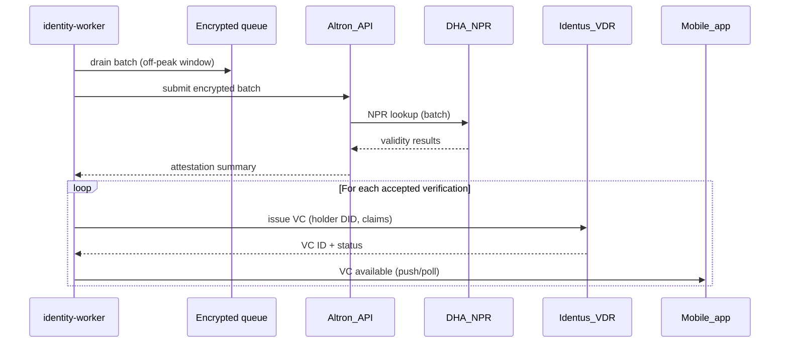

# Runbook — Identus VDR anchor + credential issuance

Scope: `services/identity-worker` VC issuance after successful Altron/DHA batch verification (ADR-0001 alignment).

## Happy path sequence



## Integration points

### 1. Holder DID creation

Before VC issuance, the resident needs a `did:midnight` (or similar Midnight DID method):

- Mobile app generates key pair on first launch
- Submits DID creation request to Identus VDR during onboarding
- Stores DID reference locally; used as VC holder

Implementation: `services/identity-worker/src/identus/holder.ts`

### 2. VC schema for residency proof

Minimal claims (selective disclosure ready):

```json
{
  "@context": ["https://www.w3.org/2018/credentials/v1"],
  "type": ["VerifiableCredential", "ResidentCredential"],
  "credentialSubject": {
    "residentStatus": "verified",
    "verificationDate": "2026-05-05T12:00:00Z",
    " DHAReference": "<correlation-id>"
  },
  "issuer": "did:identus:<issuer-did>",
  "issuanceDate": "2026-05-05T12:00:00Z"
}
```

### 3. Identus SDK integration

Reference: https://github.com/hyperledger/identus-sdk (or successor)

Interface to implement:

```typescript
interface IdentusClient {
  createHolderDID(): Promise<DID>;
  issueCredential(holderDID: DID, claims: CredentialClaims): Promise<VCResult>;
  checkStatus(vcId: string): Promise<VCStatus>;
}
```

Implementation target: `services/identity-worker/src/identus/client.ts`

### 4. Error handling + retry

| Failure | Action |
|---------|--------|
| Identus API timeout | retry with exponential backoff (max 3) |
| VC issuance rejected | mark outcome `retry`, re-queue after window |
| Holder DID not found | fail closed — requires mobile re-onboarding |
| Invalid claims schema | log aggregate error, skip VC for that item |

## Environment requirements

```env
IDENTUS_API_URL=https://<region>.atalaprism.io/api
IDENTUS_ISSUER_DID=did:identus:<uuid>
IDENTUS_API_KEY=<sandbox-key>  # never commit
```

Document in `.env.example` (no secrets).

## Verification

1. Run dry-run with synthetic accepted verifications
2. Verify VC struct validates against W3C schema
3. Confirm logs emit only correlation IDs + aggregate counts

```bash
pnpm --filter identity-worker run dry-run
# Check output for VC issuance paths (stubbed in dry-run mode)
```

## Next steps

- Wire Identus client in production mode (requires `IDENTUS_API_KEY`)
- Add VC status check endpoint for mobile polling
- Implement selective disclosure for reduced data exposure

## Implementation status

- ✅ Client interface: `services/identity-worker/src/identus/client.ts`
- ✅ Batch processor integration: `services/identity-worker/src/index.ts`
- ✅ Stub client for testing: `createStubIdentusClient()`
- ✅ Dry-run verification: 16/24 VCs issued successfully
- ✅ Env template: `services/identity-worker/.env.example`