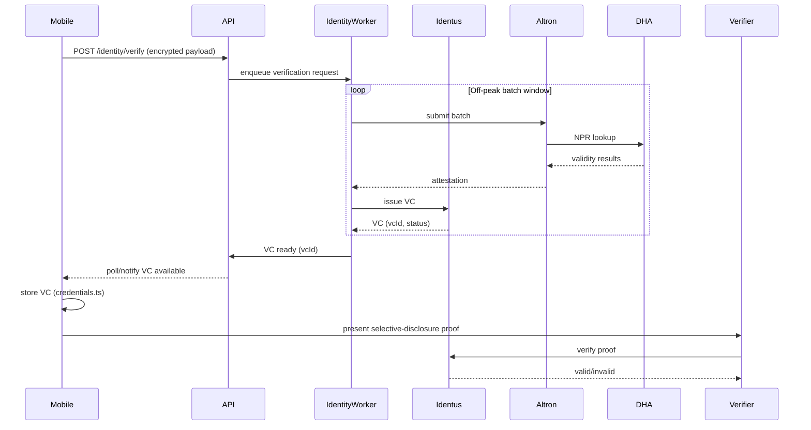

# Runbook — Mobile VC handoff (Midnames)

Scope: Mobile app receiving and presenting Verifiable Credentials from Identus/Midnames.

## Overview

After successful DHA verification (via Altron batch), the identity-worker issues a VC through Identus. The mobile app needs to:

1. **Receive** the VC (polling or push)
2. **Store** the VC securely
3. **Present** selective-disclosure proofs to verifiers

## Current Implementation

### Mobile side
- `apps/mobile/src/credentials.ts` — CredentialStore for VC management
- Methods: `requestVerification()`, `presentCredential()`, `checkStatus()`
- Storage: localStorage (placeholder, replace with secure storage)

### Identity-worker side
- `services/identity-worker/src/identus/client.ts` — IdentusClient interface
- VC issuance integrated into batch processor flush flow
- VC records available via `getIssuedVCs()`

## Flow



## Integration points

### API endpoint (to implement)

```typescript
// GET /api/identity/vc/:correlationId
// Returns VC if issued and ready

// POST /api/identity/vc/:vcId/present
// Returns selective-disclosure proof for verifier
```

### Mobile credentials.ts

- Replace localStorage with secure storage (Keychain/Keystore)
- Add VC validation on receipt
- Implement proper polling interval

## Verification

```bash
# Run identity-worker dry-run
pnpm --filter identity-worker run dry-run

# Output includes vcIssued count and vcIds
```

## Next steps

1. Wire API endpoints for VC retrieval
2. Replace localStorage with secure mobile storage
3. Add VC refresh/revocation handling
4. Implement verifier interaction UI